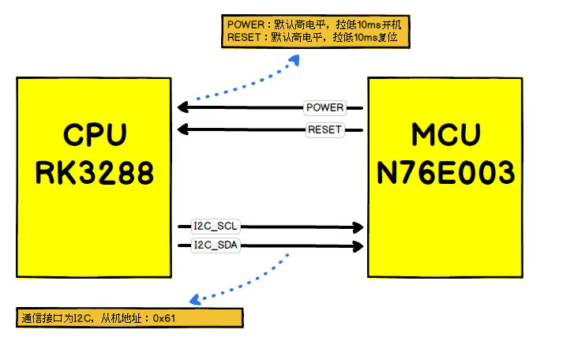
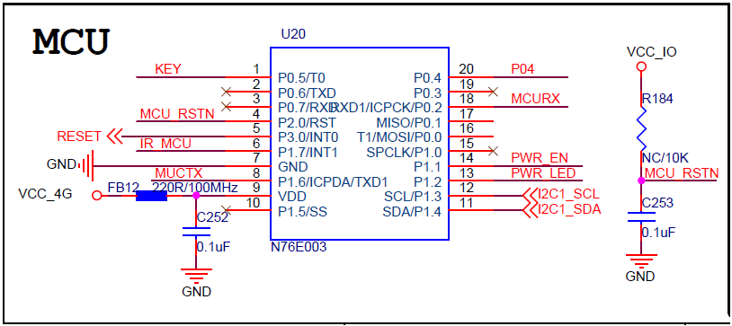

# Android定时开机功能
此方案用于实现Android主板的定时开机与Watchdog功能，应用于一些特殊产品，如：广告机、自动售货机等。

## 框图


## 原理图


## 说明
1. Watch Dog  
Watch Dog功能默认关闭，直到Android发送命令打开Watch Dog功能。如果Watch Dog功处于打开状态，Android系统会在小于Watch Dog超时时长内定时发送心跳数据给MCU，如果Watch Dog超时时长到，仍未收到心跳数据，则拉低RESET引脚10ms，使CPU复位重启。
2. 定时开机  
当MCU收到数据后启动计时，时间到拉低POWER引脚10ms，使CPU开机，同时清除本次定时任务，直到下次CPU重新下发新的定时任务。

## 协议
通信接口为I2C，从机地址：0x61  

功能 | 命令 | 数据 | R/W
---|---|---|---
心跳 | 0x01 | 0x55 | W
定时开机 | 0x02 | 4bytes （倒计时，单位：秒，最大值为1年的秒数：31536000，大端模式高位在前） 0x00：取消定时开机| W
开关Watch Dog | 0x03 | 0x01：打开 0x02：关闭 默认：关闭 | W
设置Watch Dog超时时长 | 0x04 | 2bytes （倒计时，单位：秒，最大值：65535，大端模式高位在前） 默认：180秒（3分钟） | W

## 使用
1. 复制 n76e003 到 kernel/drivers/misc/ 目录下.
2. 修改 kernel/drivers/misc/Kconfig：
```
source "drivers/misc/n76e003/Kconfig"
```
3. 修改 kernel/drivers/misc/Makefile：
```
obj-$(CONFIG_N76E003_DRIVER) += n76e003/
```
4. 修改 dts
```
	&i2c2 {  
		status = "okay";
		n76e003@61 {
			compatible = "nuvoton,n76e003";
			reg = <0x61>;
			status = "okay";
		};
	};
```
5. 移植 frameworks.patch

## 开发者
* ayst.shen@foxmail.com

## License
	Copyright  (C)  2016 - 2017 Topband. Ltd.

    This program is free software; you can redistribute it and/or modify
    it under the terms of the GNU General Public License as published by
    the Free Software Foundation; either version 2 of the License, or
    (at your option) any later version.

    This program is distributed in the hope that it will be a reference
    to you, when you are integrating the nuvoTon's N76E003 IC into your system,
    but WITHOUT ANY WARRANTY; without even the implied warranty of
    MERCHANTABILITY or FITNESS FOR A PARTICULAR PURPOSE.  See the GNU
    General Public License for more details.
